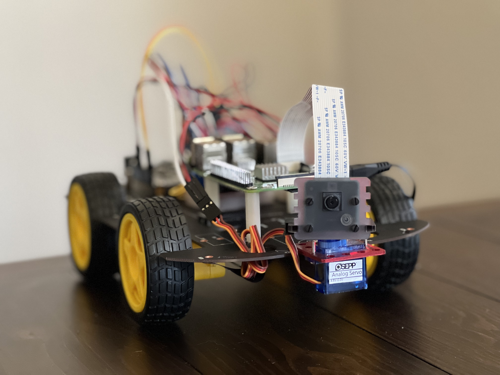
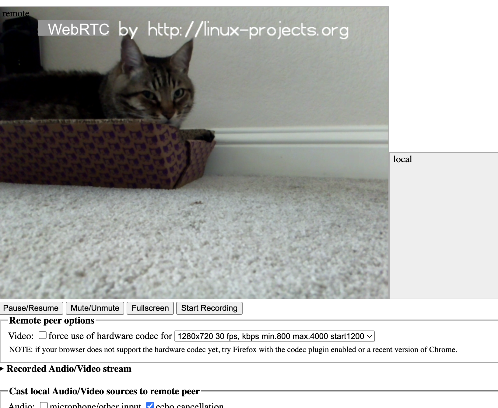

# Robot Car

A robot car that I can remotely drive to check up on my cats and patrol the house while I am away. I see everything 
through the robot's camera. The robot uses Arduino, Raspberry Pi, and WebRTC for P2P real-time video, audio, and 
bidirectional data exchange.

Arduino is to interact with sensors and has more capabilities than the Raspberry Pi; the Pi is a controller, the robot’s 
brain. The Pi sends me the live video stream through WebRTC while driving through the house, and it responds to commands 
I send remotely through the WebRTC data channel.

### A handsome robot

### The kitty whom I see through the robot:

