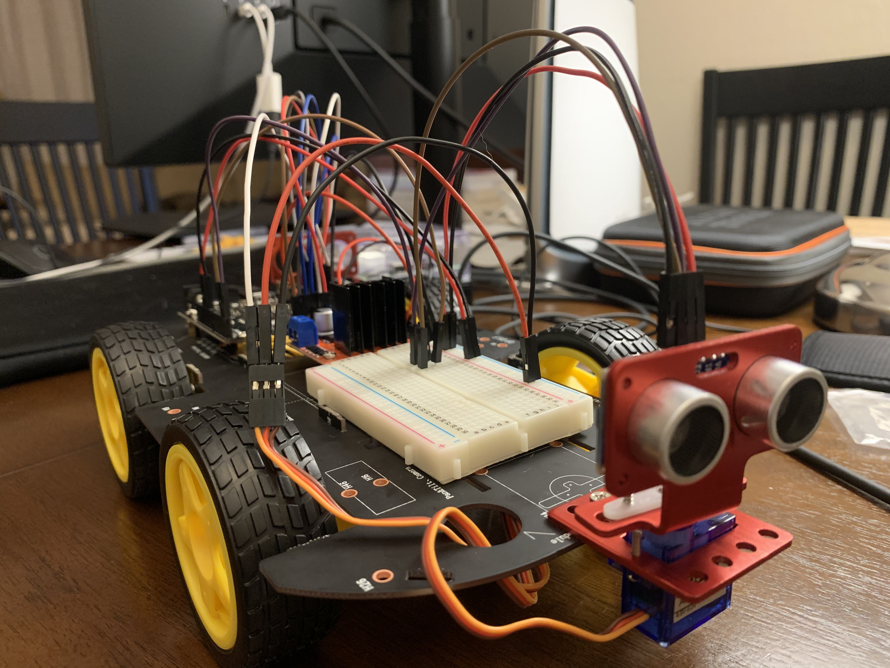

### setup the command center environment (on Mac):
```
>> python3 -m venv tensor_env
>> source tensor_env/bin/activate
(tensor_env) >> pip install --upgrade pip
(tensor_env) >> pip install -r requirements.txt

# install Tkinter, python graphic UI for key stroke detection. 
(tensor_env) >> sudo apt-get install python-tk
```

### Setup the robot controller environment: (on Raspberry Pi)
```
>> python3 -m venv tensor_env
>> source tensor_env/bin/activate
(tensor_env) >> pip install --upgrade pip
(tensor_env) >> pip install -r requirements_raspi.txt 
```

### Arduino and Raspberry Pi communication:
1. Direct communication using the USB serial port: <br> 
https://www.woolseyworkshop.com/2020/02/05/controlling-an-arduino-from-a-raspberry-pi/
2. Use firmata: <br>
```(tensor_env) >> pip install pyfirmata``` <br>
https://roboticsbackend.com/control-arduino-with-python-and-pyfirmata-from-raspberry-pi/
3. Use IOC bus to do logical level conversion: <br>
https://dronebotworkshop.com/i2c-arduino-raspberry-pi/

### Start Kafka server (if use Kafka for data)
download Kafka server package from:<br>
https://docs.confluent.io/platform/current/installation/installing_cp/overview.html#installation-archive

```
./bin/zookeeper-server-start ./etc/kafka/zookeeper.properties
./bin/kafka-server-start ./etc/kafka/server.properties
```

### Configure WebRTC on Raspberry Pi
1. Install UV4L streaming server on Raspberry Pi according to [these instructions](https://www.linux-projects.org/uv4l/installation/). 
2. Configure SSL on Raspberry Pi for the UV4L server in `/etc/uv4l/uv4l-raspicam.conf` 
3. View live video captured from the Pi camera in a browser: `https://<raspihost>:<uv4lport>/`
4. use arrow keys to control the robot to go forward, right, left, back. Use `space` key to stop the robot car.

### Controlling DC Motors with L298N Dual H-Bridge and an Arduino 
https://dronebotworkshop.com/dc-motors-l298n-h-bridge/ 

