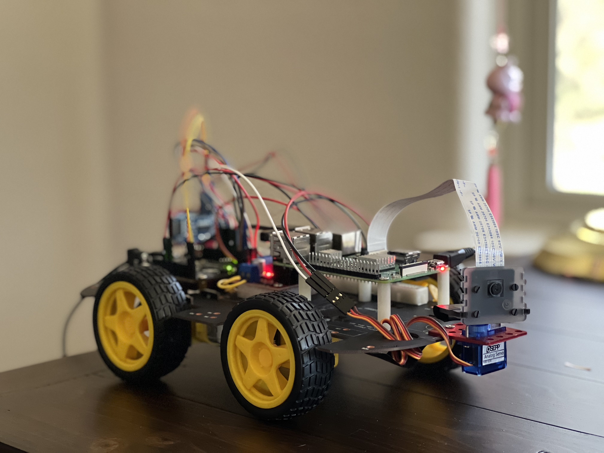
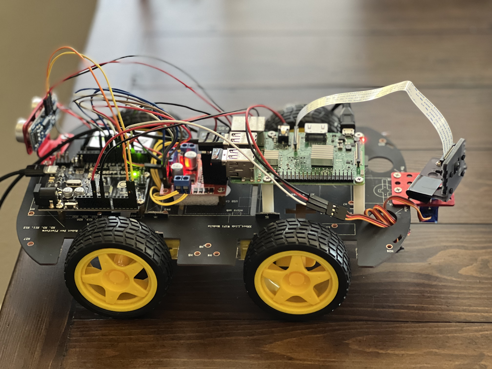

### Setup the robot controller environment: (on Raspberry Pi)
```
>> python3 -m venv tensor_env
>> source tensor_env/bin/activate
(tensor_env) >> pip install --upgrade pip
(tensor_env) >> pip install -r requirements_raspi.txt 
```

### Arduino and Raspberry Pi communication options:
1. Direct communication using the USB serial port: <br> 
https://www.woolseyworkshop.com/2020/02/05/controlling-an-arduino-from-a-raspberry-pi/
2. Use firmata: <br>
```(tensor_env) >> pip install pyfirmata``` <br>
https://roboticsbackend.com/control-arduino-with-python-and-pyfirmata-from-raspberry-pi/
3. Use IOC bus to do logical level conversion: <br>
https://dronebotworkshop.com/i2c-arduino-raspberry-pi/

I chose option #2 since it is same as approach #1, using USB serial port, but with simpler interface.

### Configure WebRTC on Raspberry Pi
1. Install UV4L streaming server and other modules on Raspberry Pi according to [these instructions](https://www.linux-projects.org/uv4l/installation/). 
2. Configure SSL on Raspberry Pi for the UV4L server in `/etc/uv4l/uv4l-raspicam.conf` 
3. Start uv4l_raspicam if it is not already started: `$ sudo service uv4l_raspicam start`
4. View live video captured from the Pi camera in a browser: open web page `https://<raspihost>:8080/stream/webrtc`, and click the green "Call!" button
5. Start `command_processor_webrtc.py` in python virtual environment. 
   1. need to set PYTHONPATH: `export PYTHONPATH='/home/pi/dev/edge_ai/robot_car'`
6. In "Data Channels" section, check "send key codes", click the "message" box, and use arrow keys to control the robot's direction (forward, right, left, back) and use `space` key to stop the robot car.

### Controlling DC Motors with L298N Dual H-Bridge and an Arduino 
https://dronebotworkshop.com/dc-motors-l298n-h-bridge/ 


